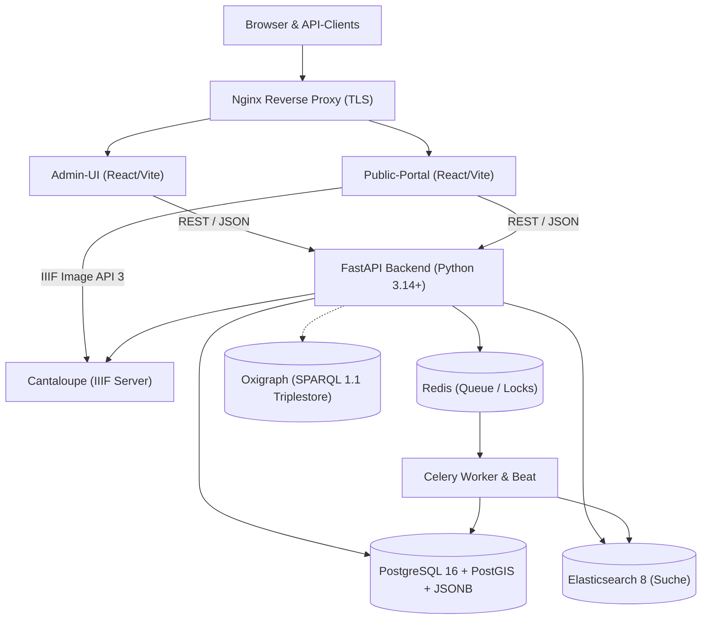

# Katalon Collections

Turn-key Open-Source Metadata Management System (MMS) für den GLAM-Sektor — Galerien, Bibliotheken, Archive, Museen.

*Katalon Collections* (kurz "Katalon" im Code und in der Entwicklungsdokumentation) ist eigenständig und nicht mit [katalon.com](https://katalon.com/) (Test-Automatisierung) verbunden.

Katalon verbindet flexible, dynamische Metadatenschemata mit einer sauberen REST-API, zwei spezialisierten Frontends und einer containerisierten Deployment-Infrastruktur.

> Both the Admin UI and the public Portal are fully multilingual, shipping with German and English out of the box. Field labels, vocabulary terms, and other collection metadata support any number of languages per install, configured through the UI. Additional UI interface languages can be added via a small locale file, no core code changes required.

---

## Was ist Katalon?

Sammlungsverantwortliche stehen vor der Herausforderung, heterogene Bestände mit individuellen Metadatenfeldern zu erfassen, zu verknüpfen und der Öffentlichkeit zugänglich zu machen. Katalon setzt dabei auf *Configuration over Coding*: Schemata werden konfiguriert statt programmiert.

Katalon baut auf einem modernen Stack:

- **Dynamische Schemata** — Jedes Feld pro Typ konfigurierbar, wiederholbar, mehrsprachig
- **Kontrollierte Vokabulare** — Hierarchische Begriffssysteme mit Import aus CSV/JSON
- **Typisierte Relationen** — Fachlich benannte Formularfelder und freie Zusatzbeziehungen im gemeinsamen Beziehungsgraphen
- **IIIF als first-class citizen** — Hochauflösender Deep-Zoom für Digitalisate
- **Volltextsuche**
- **Facettierte Suche über alle Bestände**
- **Theme-System** — Public-Portal per Drop-in-Bundle anpassbar (Farben, Logo, Schrift, Layout), kein Rebuild nötig — [Doku](https://katalon-collections.github.io/katalon-docs/administration/portal-themes/)

Unique Selling Points:

- Extrem konfortabler Datenimport (WYSIWYG Mapping inkl. Transformationen)
- Skalierbare Architektur
- Exporter GUI (Eigenes Datenmodell auf Schema mappen)
- KI-assistierte Felder
- Extrem einfache Installtion dank Docker Compose

---

## Prinzipien

1. **Datenintegrität und Sicherheit von Metadaten und Medien**
2. **User Experience: Simplizität und Flexibilität.** Kuratorinnen und Sachbearbeiter konfigurieren Schemata über die Oberfläche, nicht über Config-Dateien oder Code. Die Software passt sich an die Sammlung an und nicht umgekehrt.
3. **Techstack.** Moderne, etablierte und gut gewartete Technologien. Performance und Angriffsresistenz. Eine Portalansicht kommt direkt mit. Mit überschaubarem Aufwand zu Installieren und Betreiben.
4. **Kostenlos, einfach anpassbar, Import selbst machbar.** Katalon ist Open Source, keine Lizenzkosten. Institutionen mit kleinem Budget importieren ihre Bestände selbst (Smart Importer, Dry-Run-Vorschau) statt einen Dienstleister zu beauftragen.
5. **Kein Lock-in.** REST-API mit OpenAPI-Spec, OAI-PMH, ein dokumentiertes, einfaches Datenmodell. Institutionen nehmen ihre Daten jederzeit mit.
6. **Standardkonformität.** Anschluss an GLAM-Standards (IIIF, Dublin Core, ggf. LIDO/EAD) statt proprietärer Formate. Nutzung von Normdaten.
7. **Barrierefreiheit.** Das öffentliche Portal ist für alle nutzbar.
8. **Anpassbar.** Falls doch eine Speziallösung oder ein eigenes Portal genutzt werden soll.

---

## Schnellstart

```bash
# Repository klonen
git clone https://github.com/katalon-collections/katalon.git
cd katalon
./install.sh --up
```

**Voraussetzungen:** Docker + Docker Compose v2

### Erster Login

Beim ersten Start generiert Katalon automatisch ein sicheres Admin-Passwort. `install.sh` zeigt die Zugangsdaten direkt nach dem Start an und kopiert sie nach `./first-run-credentials.txt`.

Wer den Stack ohne `install.sh` startet (z. B. `docker compose up -d`), findet die Zugangsdaten:

```bash
# im API-Container
docker compose exec api cat /var/lib/katalon/first-run-credentials.txt

# oder in den Logs (einmalig beim ersten Start)
docker compose logs api | grep -A5 "KATALON FIRST RUN"
```

> **Ohne gesetztes `KATALON_BASE_URL`** (z. B. lokale Entwicklung) wird statt eines generierten Passworts der Wert `INITIAL_ADMIN_PASSWORD` aus der `.env` verwendet (Standard: `admin`). Mit gesetzter `KATALON_BASE_URL` gilt `INITIAL_ADMIN_PASSWORD`, falls gesetzt und kein Standardwert, sonst wird ein Zufallspasswort erzeugt.

---

## Architektur



**Stack:** FastAPI · PostgreSQL 16 + PostGIS · Elasticsearch 8 · Redis · Celery · Cantaloupe (IIIF) · Oxigraph (SPARQL) · React 18 + TypeScript

---

## Kernfunktionen

### Sieben Kerntypen (`RECORD_TYPES`)

| Typ | DB-Tabelle | Beschreibung | Beispiele |
|---|---|---|---|
| **Object** | `objects` | Physische oder digitale Artefakte | Fotografie, Dokument, Gemälde, Digitalisat |
| **Entity** | `entities` | Personen oder Organisationen | Fotograf:in, Verlag, Sammler:in, Institution |
| **Place** | `places` | Geografische Orte (PostGIS-Punktgeometrie) | Stadtbezirk, Gebäude, Fundort, Region |
| **Occurrence** | `occurrences` | Werke (FRBR), Ereignisse, Konzepte | Musikwerk, Ausstellung, historische Epoche |
| **Collection** | `collections` | Sammlungen, Bestände, Archivtektonik | Nachlass, Fotosammlung, Teilbestand |
| **Storage Location** | `storage_locations` | Standort- & Lagerortverwaltung (hierarchisch) | Magazin A → Raum 102 → Regal 4 → Fach B |
| **Procedure** | `procedures` | Vorgangsverwaltung & Fachprozesse | Leihverkehr, Restaurierung, Erwerbung |

Alle Typen haben **optimistische Sperren** (`version`), Zeitstempel und **frei konfigurierbare Metadatenfelder** — definiert im Admin-UI und dynamisch in der Datenbank gespeichert (JSONB).

### Schema-Engine

Felder pro Typ definierbar mit:

- Feldtyp (Text, Datum, Zahl, Geo, Vokabular, Relation, Boolean)
- Wiederholbarkeit
- Pflichtfeld
- Mehrsprachige Labels
- Feldspezifische Einstellungen

### Beziehungen und verknüpfte Suche

Fachlich benannte Beziehungen wie „Autor:in“ oder „Aufnahmeort“ werden als
Relationsfelder im Schema konfiguriert. Sie können einen Zieltyp, ein
Relationstyp-Vokabular und optional einen festen Relationstyp festlegen.
Die Beziehungen-Karte zeigt den vollständigen Graphen und erfasst nur weitere,
freie Beziehungen zu anderen Haupttypen.

Ausgewählte Felder verknüpfter Records können in Elasticsearch eingebettet und
im Portal als Facetten aktiviert werden. Ein festgelegter Relationstyp begrenzt
die Suche auf diese fachliche Beziehung; ohne ihn werden alle Beziehungen zum
gewählten Zieltyp berücksichtigt.

### Vokabulare

Hierarchische kontrollierte Begriffssysteme — importierbar aus CSV, TSV oder JSON. Unterstützt Übersetzungen, Oberbegriffe und externe IDs (z. B. GND).

### Normdaten-Integration

Integrierte Adapter für GND, GeoNames, VIAF, Wikidata, Getty TGN und ICONCLASS. Normdaten-Einträge können direkt in Erfassungsformularen gesucht und verknüpft werden.

### OAI-PMH

Standardschnittstelle für Metadaten-Harvesting mit generischer Export-Mapping-Schicht. OAI-PMH nutzt aktuell `oai_dc`, spaeter koennen weitere Formate wie LIDO oder METS/MODS an dieselbe Infrastruktur angeschlossen werden.

### Theming

Das Public-Portal ist vollständig themebar per **Drop-in Bundle** — kein Rebuild, kein Store:

```bash
# Theme ablegen
cp -r mein-archiv/ /var/lib/katalon/themes/mein-archiv/

# Aktivieren
echo "PORTAL_THEME=mein-archiv" >> .env
docker compose restart portal
```

Ein Theme-Bundle besteht aus `theme.json` (CSS-Tokens, Fonts, Logo) + optionalem `custom.css`.

---

## API

OpenAPI-Dokumentation: `http://localhost:8000/api/docs`

Wichtige Endpunkte:

| Methode        | Pfad                           | Beschreibung                                               |
|----------------|--------------------------------|------------------------------------------------------------|
| POST           | `/v1/auth/token`               | JWT-Login                                                  |
| GET            | `/v1/objects`                  | Objekte auflisten (Pagination, Filter)                     |
| POST           | `/v1/objects`                  | Neues Objekt anlegen                                       |
| GET/PUT/DELETE | `/v1/objects/{id}`             | Objekt lesen/aktualisieren/löschen                         |
| GET            | `/v1/schema/{target_type}`     | Felddefinitionen abrufen                                   |
| GET/POST       | `/v1/schema/import`            | Schema aus YAML/JSON importieren                           |
| GET            | `/v1/vocabularies`             | Vokabulare auflisten                                       |
| POST           | `/v1/vocabularies/{id}/import` | Vokabular-Terme aus CSV/JSON importieren (Dry-Run/Replace) |
| GET            | `/v1/search`                   | Volltext- und Facettensuche                                |
| POST           | `/v1/pids/mint`                | ARK oder DNB-URN über den PID-Feldanbieter vergeben        |
| GET            | `/v1/authorities/search`       | Normdaten-Suche                                            |
| GET            | `/oai`                         | OAI-PMH Endpoint                                           |
| GET            | `/v1/portal/config`            | Portal-Konfiguration                                       |
| POST           | `/v1/portal/logo`              | Logo hochladen                                             |
| GET            | `/v1/audit`                    | Audit-Log abrufen                                          |

### Persistente Identifier (PID)

- PID-Felder verwenden ARK oder DNB-URN; sie sind erst in der Schema-Verwaltung auswählbar, wenn ihr Dienst vollständig konfiguriert ist.
- ARKs brauchen einen registrierten produktiven NAAN und eine dauerhafte `KATALON_BASE_URL`; die Instanz löst sie unter `/ark:/<NAAN>/<Suffix>` auf.
- Für lokale DNB-URN-Entwicklung kann der Mock-Endpunkt genutzt werden: `DNB_URN_API_URL=http://localhost:8000/v1/dnb-urn-mock`.

## Admin-UI

- **Objekte / Entitäten / Orte / Occurrences** — Tabellenansicht + dynamisches Erfassungsformular
- **Schemata** — Feldkonfiguration pro Typ, YAML/JSON-Import
- **Metadaten-Export** — Felddefinitionen auf Exportformate mappen
- **Vokabular** — Kontrollierte Listen verwalten
- **Importer** — CSV/Excel-Import-Wizard mit Dry-Run
- **Statische Seiten** — Portal-Inhaltsseiten
- **Benutzer** — Rollenbasierte Benutzerverwaltung
- **Einstellungen** — Portal-Konfiguration, Logo, Farben
- **Audit-Log** — Vollständige Änderungshistorie

---

## Dokumentation

Die Anwenderdokumentation liegt im separaten Docs-Repository:

```text
https://katalon-collections.github.io/katalon-docs/
```

Die lokale `docs/`-Ablage enthält nur technische Entwickler- und Betriebsdokumentation.

---

## Entwicklung am Quellcode

Für Beiträge zum Quellcode steht ein Docker-Dev-Stack mit Live-Reload bereit:

```bash
make dev
```

Backend und beide Frontends laufen darin mit Live-Reload; die Oberflächen
sind unter `http://localhost:4000` (Admin) und `http://localhost:4001`
(Portal) erreichbar, die API-Dokumentation unter
`http://localhost:8000/api/docs`. Nach dem Start oder nach Änderungen an
Migrationen: `make migrate`.

`make up` startet stattdessen den production-like Stack im Hintergrund
(Zugriff über nginx unter `http://localhost/` bzw. `http://localhost/admin/`)
— nützlich zum End-to-End-Testen des gebauten Stacks, nicht als täglicher
Entwicklungsworkflow.

## Lizenz

[AGPL-3.0-or-later](LICENSE)

### Haftungsausschluss

Katalon Collections wird als freie Open-Source-Software unter der GNU Affero General Public License v3.0 (AGPL-3.0) bereitgestellt.

Die Software wird "wie besehen" und ohne jegliche Gewährleistung bereitgestellt, wie in der Lizenz näher spezifiziert.

Katalon Collections kann zur Speicherung, Verwaltung und Veröffentlichung wertvoller, vertraulicher oder personenbezogener Daten eingesetzt werden. Betreiberinstitutionen sind allein verantwortlich für den sicheren Einsatz und Betrieb ihrer Installation, insbesondere für:

- regelmäßige und getestete Backups,
- Zugriffskontrolle und Authentifizierung,
- TLS und Netzwerksicherheit,
- sichere Konfiguration und Secrets-Management,
- Einspielen von Sicherheits- und Abhängigkeits-Updates,
- Einhaltung geltender datenschutzrechtlicher und sonstiger gesetzlicher Anforderungen,
- Prüfung und Test vor dem Einsatz in Produktivumgebungen.

Keine Software kann vollständigen Schutz vor Softwarefehlern, Datenverlust, unbefugtem Zugriff oder anderen Sicherheitsvorfällen garantieren.

Bitte [LICENSE](LICENSE), [DISCLAIMER.md](DISCLAIMER.md) und [SECURITY.md](SECURITY.md) vor dem Produktiveinsatz von Katalon Collections lesen.
